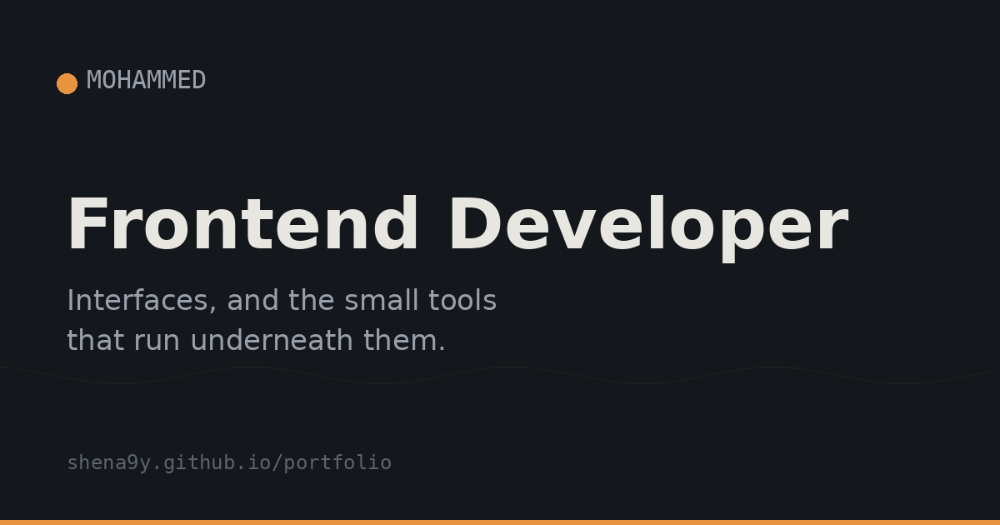

# Mohammed — Portfolio Website

A personal portfolio website for a frontend developer, presenting an interactive canvas hero animation, a curated project showcase, a skill overview, and a functional contact form. The site is built entirely with vanilla HTML, CSS, and JavaScript — no frameworks, no build step, no external dependencies beyond web fonts and a form-handling service.

🔗 **Live site:** [shena9y.github.io/portfolio](https://shena9y.github.io/portfolio/)

---

## ✨ Features

- **Interactive hero wallpaper** — animated flowing wave lines rendered on the HTML5 Canvas API. The waves ripple continuously and respond dynamically to cursor and touch input, layered above a subtle proximity-reactive dot grid.
- **Responsive layout** — desktop, tablet, and mobile breakpoints implemented with CSS Grid and fluid `clamp()`-based typography.
- **Dark terminal-inspired theme** — a custom design system built on CSS custom properties, featuring amber (`#e8933d`) and teal (`#5fa8a0`) accents against a deep charcoal background.
- **Functional contact form** — asynchronous submission via [Formspree](https://formspree.io), with inline success/error status reporting and a concealed **honeypot field** for passive spam mitigation.
- **Accessibility compliance** — skip-to-content navigation, semantic HTML structure, visible focus indicators, ARIA labeling, and full adherence to the `prefers-reduced-motion` media query.
- **Performance considerations** — the animation loop halts when the hero section exits the viewport (`IntersectionObserver`) and when the tab is backgrounded (`visibilitychange`); device pixel ratio is capped at 2×.
- **SEO and social integration** — Open Graph and Twitter Card metadata, theme-color declaration, and a complete favicon set (SVG, PNG, Apple touch icon).

## 🛠 Tech Stack

| Layer      | Technology                                       |
| ---------- | ------------------------------------------------ |
| Markup     | Semantic HTML5                                   |
| Styling    | Vanilla CSS (custom properties, Grid, `clamp()`) |
| Behavior   | Vanilla JavaScript (Canvas API, Fetch API)       |
| Typography | Space Grotesk, IBM Plex Sans, IBM Plex Mono      |
| Forms      | Formspree (no backend required)                  |

## 📄 Page Sections

### 🏠 Hero

A full-viewport introduction with the canvas animation behind the headline:

> _"I build interfaces, and the small tools that run underneath them."_

Provides two calls to action: **View work** and **Get in touch**.

### 👤 About — Section 01

A professional summary describing the developer's methodology, accompanied by three skill "channel" cards, each with a progress bar and technology tags:

- **Frontend (core)** — HTML, CSS, JavaScript, Bootstrap
- **Desktop & CLI (applied)** — Node.js, Electron, yt-dlp, Python
- **Systems (tinkering)** — Deployment, Windows internals, Audio routing

### 💼 Selected Work — Section 02

A project list with hover-animated rows (horizontal slide with an accent-side indicator):

| Project                                    | Type            | Stack                              | Reference                                                        |
| ------------------------------------------ | --------------- | ---------------------------------- | ---------------------------------------------------------------- |
| **Personal Trainer / Be Personal Trainer** | Client site     | HTML/CSS/JS, Node, Express, SQLite | [Live demo](https://shena9y.github.io/be-personal-trainer-site/) |
| **fetchcli**                               | CLI tool        | Node.js                            | GitHub                                                           |
| **Maison Soleil**                          | Landing page    | HTML/CSS (container queries)       | Repository                                                       |
| **Browser extensions manager**             | Frontend Mentor | Vanilla JS, localStorage           | Repository                                                       |
| **Pointer-speed calculator**               | Tray app        | Python, Windows                    | GitHub                                                           |

### 📬 Contact

A split panel containing an introduction, profile links (GitHub, Frontend Mentor), and a contact form (Name, Email, Message). Submissions are transmitted asynchronously via Formspree. Bots completing the hidden `_gotcha` field receive a simulated success response.

## 📁 Project Structure

portfolio/
├── index.html # Single-page markup
├── style.css # Complete styling (theme, layout, responsive rules)
├── app.js # Canvas animation and contact form logic
├── favicon.svg
├── favicon-32.png
├── apple-touch-icon.png
├── og-image.png # Social share image (1200×630)
└── assets/
└── screenshots/ # README documentation images

---

